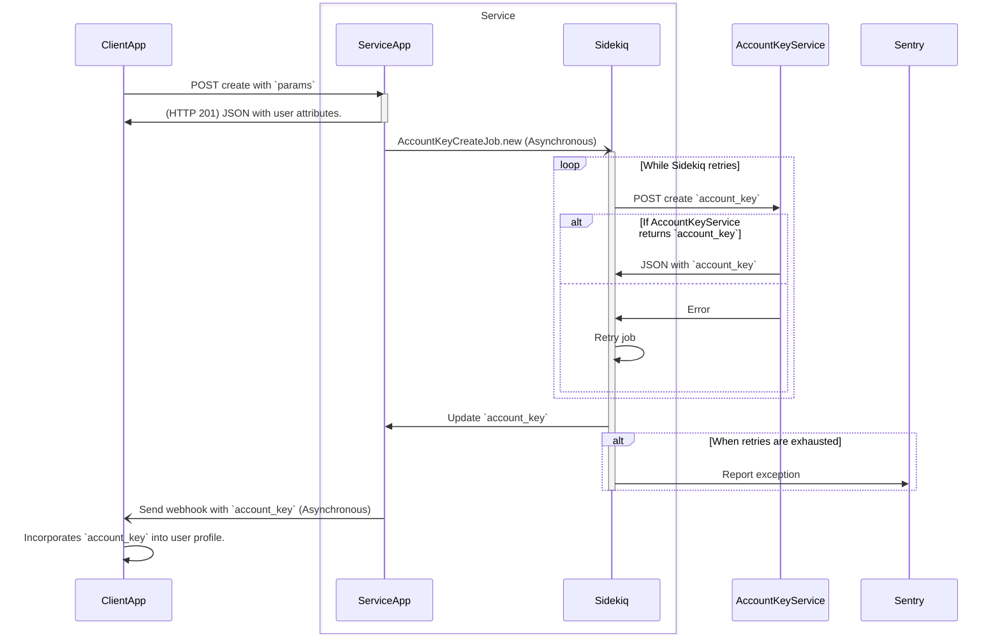

# User Service Application Demo

## Introduction

This project is a demonstration of a user service application, designed to showcase my skills in building a robust API using Ruby on Rails. The application supports the creation and retrieval of user records, integrates with an external account key service, and handles asynchronous tasks using Sidekiq. This project serves as an example of my work.

## Project Overview

This project is a user service application that supports the creation and retrieval of user records through two API endpoints:

`GET /api/users`

`POST /api/users`

The application is designed to handle new user creation, user record retrieval, and integration with an external account key service. It uses a background job to interact with the account key service, ensuring the main API responses remain fast and reliable.

It started as a Rails 5 application and was upgraded to Rails 7.1. The application uses a PostgreSQL database and Redis for Sidekiq. The application is containerized using Docker and Docker Compose for easy setup and deployment.

## Author

Martin Ferrari (<dmferrari@gmail.com>). April, 2024.

## Prerequisites

- Docker and Docker Compose
- Ruby 3.3.0
- Rails 7.1.x

## Getting Started

### Installation

1. Clone the repository:

    ```bash
    git clone git@github.com:dmferrari/user-service-application-demo.git
    cd user-service-application-demo
    ```

2. Define the Environment Variables: Environment variables are managed using the `dotenv-rails` gem. Define them in a `.env` file in the project root. There is an `.env.example` file to guide you.

    ```env
    POSTGRES_PASSWORD=change_me
    POSTGRES_USER=change_me
    REDIS_URL_SIDEKIQ=redis://localhost:6379/1
    SIDEKIQ_PASSWORD=change_me
    SIDEKIQ_USERNAME=change_me
    ```

3. Build and start the Docker containers:

    ```bash
    docker compose up --build
    ```

4. Setup the test databases in another terminal: Open another terminal and run the commands below to create the databases and run the migrations.

    ```bash
    docker compose run web bin/rails db:create db:migrate
    ```

5. Access the application at `http://localhost:3005`.

## API Endpoints

### `GET /api/users`

- Retrieves all user records, sorted by most recently created first.
- Supports optional query parameters to filter results by `email`, `full_name`, and `metadata`.
- Returns:
  - `200 OK` on success.
  - `422 Unprocessable Entity` for malformed query parameters.
  - `5xx` for server errors.

### `POST /api/users`

- Creates a new user record.
- Accepts `email`, `phone_number`, `full_name`, `password`, and `metadata` fields.
- Automatically generates a `key` field.
- Passwords are hashed with a salt value.
- An external account key service is called asynchronously to generate an `account_key`.
- Returns:
  - `201 Created` on success with the created user JSON object (excluding `account_key` initially).
  - `422 Unprocessable Entity` on validation errors.
  - `5xx` for server errors.

## JSON Specifications

### Create a User

**Request:**

```bash
curl --request POST \
  --url http://localhost:3005/api/users \
  --header 'Content-Type: application/json' \
  --data '{
    "user": {
      "email": "user@example.com",
      "full_name": "John Doe",
      "password": "password",
      "phone_number": "5551235555",
      "metadata": "male, age 32, unemployed, college-educated"
    }
  }'
```

**Response:**

```json
{
  "email": "user@example.com",
  "phone_number": "5551235555",
  "full_name": "John Doe",
  "key": "generated_key",
  "account_key": null,
  "metadata": "male, age 32, unemployed, college-educated"
}
```

### Retrieve Users

**Request:**

```bash
curl --request GET --url http://localhost:3005/api/users/
```

**Response:**

```json
[
  {
    "email": "user@example.com",
    "phone_number": "5551235555",
    "full_name": "John Doe",
    "key": "generated_key",
    "account_key": "generated_account_key",
    "metadata": "male, age 32, unemployed, college-educated"
  }
]
```

## Asynchronous Account Key Service

The application uses a background job (Sidekiq) to request `account_key` from an external service asynchronously. If the request fails, it retries a specified number of times. Successful key retrieval updates the user record and notifies the client application via a webhook.

### Sequence Diagram



## Testing

- RSpec is used for testing the application.
- Test coverage includes models, controllers, and services.
- Ensure 100% coverage for critical components.

## Notes

### Fix Missing Account Keys

A worker (`FixMissingAccountKeysWorker`) runs hourly to ensure that all user records have an `account_key`. Missing keys are requested again, and results are handled as described above.

### Password Management

Passwords are handled using the `bcrypt` gem, ensuring they are stored securely.
